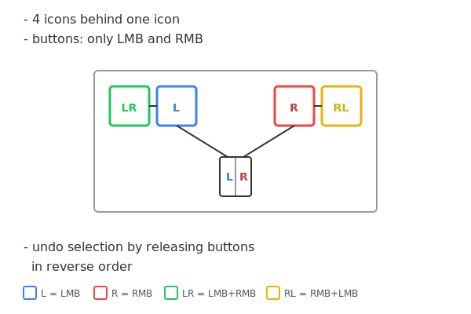

# Stenocon

A UI input concept that enables **4 selections from a single icon pair** using only left and right mouse buttons.

## The Concept

Stenocon displays two icons (L and R) side by side. By combining mouse button press sequences, users can select from 4 different options without moving the cursor:

| Action                       | Selection | Color  |
|------------------------------|-----------|--------|
| LMB click                    | L         | Blue   |
| RMB click                    | R         | Red    |
| LMB down → RMB down → RMB up | LR        | Green  |
| RMB down → LMB down → LMB up | RL        | Yellow |

### Key Benefits

- **4 selections per icon** - Quadruples information density
- **No cursor movement required** - Selection happens in place
- **Drag & drop compatible** - Hold button(s) and drag to target
- **Undo by release order** - Cancel by releasing first button before second

## Demo

**[Live Demo](https://your-github-username.github.io/stenocon/demo.html)** - Interactive RPG inventory example



### Try It Locally

```bash
git clone https://github.com/your-username/stenocon.git
cd stenocon
# Open demo.html in your browser

# For index.html with embedded videos:
python -m http.server 8000
# Open http://localhost:8000/
```

## How It Works

When you press a mouse button on a stenocon icon:

1. **Single button press** → Shows the primary selection (L or R)
2. **While holding, press second button** → Combo option appears highlighted (LR or RL)
3. **Release second button** → Confirms the combo selection
4. **Release first button instead** → Cancels (returns to neutral)

### Modifiers

- **Shift** - Swaps L↔LR and R↔RL while held
- **Tab** - Toggles the swap persistently
- **Number keys 1-4** - Select target slot directly

## Files

| File | Description |
|------|-------------|
| `demo.html` | Interactive browser demo |
| `index.html` | Documentation with videos and pseudocode |
| `diagram.svg` | Concept diagram |
| `PSEUDO.md` | Selection logic pseudocode |
| `KONSEPTI.md` | Original concept (Finnish) |
| `ESIMERKKI.md` | RPG inventory example (Finnish) |

## Video Demonstrations

- [Demo Video 1](https://youtu.be/9v0Tn9rg1wI)
- [Demo Video 2](https://youtu.be/3PMcCJ5e280)

## Use Cases

- **Game hotbars** - 4x more abilities per slot
- **Tool palettes** - Compact toolbars with sub-tool access
- **Emoji pickers** - Related emoji variants
- **File managers** - Primary action + alternatives
- **Any UI with limited space** - Increase density without sacrificing usability

## Selection Logic

```
IF only LMB pressed and released → L
IF only RMB pressed and released → R
IF LMB first, then RMB, release RMB → LR
IF RMB first, then LMB, release LMB → RL
IF buttons released in wrong order → Cancel
```

See [PSEUDO.md](PSEUDO.md) for detailed pseudocode.

## License

MIT
